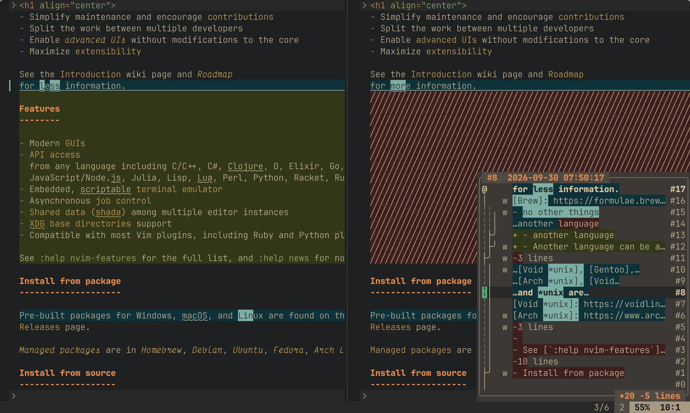

# diffundo.nvim

Open a vertical diffsplit against a files undo history, and quickly find and pull changes
from your undo history into your current buffer.

Requires neovim 0.10 or newer.



# Installation

Use your favorite package manager to install this plugin. Example configuration:

```lua
return {
  "dsummersl/diffundo.nvim",
  dependencies = {
    "tpope/vim-repeat",
  },
  config = function()
    vim.keymap.set("n", "<leader>du", ":Diffundo earlier<cr>", { desc = "Diffundo earlier" })
    vim.keymap.set("n", "<leader>dl", ":Diffundo later<cr>", { desc = "Diffundo later" })
    vim.keymap.set("n", "<leader>dU", ":Diffundo earlier 1f<cr>", { desc = "Diffundo earlier 1f (write)" })
    vim.keymap.set("n", "<leader>dL", ":Diffundo later 1f<cr>", { desc = "Diffundo later 1f (write)" })
    vim.keymap.set("n", "<leader>d/", ":Diffundo search ", { desc = "Diffundo search" })
    vim.keymap.set("n", "<leader>df", ":Diffundo focus<cr>", { desc = "Diffundo focus" })
    vim.keymap.set("n", "<leader>dc", ":Diffundo close<cr>", { desc = "Diffundo close" })
  end,
}
```


# Commands

The `:Diffundo` command acts as 'diff wrapper' around the builtin `:earlier`, `:later`, and `:undo` ex commands.

Subcommands that open a diff split:

- `:Diffundo earlier <count>` - ...against an older state (see [:earlier](https://neovim.io/doc/user/undo/#%3Aearlier))
- `:Diffundo later <count>` - ...against a newer state (see [:earlier](https://neovim.io/doc/user/undo/#%3Alater))
- `:Diffundo undo <n>` - ...against a specific undo state (see [:undo {n}])
- `:Diffundo search <pattern>` - ...against the next undo that introduced text that added `<pattern>`. Use `search!` to search undos that removed `<pattern>`.

Other commands:
- `:Diffundo focus` - open the diff split and focus on the history pane. If the diff split is already open, focuses on the history pane.
- `:Diffundo close` - close the diff and hovering history window.

# History pane

## miniview

While the diff split is open, a small pane in the diff window's lower right
corner shows what the diff split is comparing.

```
╭─ #4  2026-09-26 10:12:03 ────────╮   <- what we're currently diffing, and when the change happened
│@ w + return x                 #12│   <- the undo # of your current buffer (what you're editing now); `w` = written to disk
│┆     7 undos 1w                  │   <- states in between (total + # written to disk)
│╷ w - local y = 1               #4│   <- the undo that the diff shows (the write column is its own column)
│┆     3 undos                     │   <- states below...
╰──────────────────── +3 -5 lines ─╯
```


## focus mode

When you use `:Diffundo focus` the pane expands to show the full undo
history and you are put into history window so that you can explore the full undo tree.

- `j`/`k` are plain motions (not mapped by the plugin).
- `J`/`K` move to the next/previous undo that was written to disk.
- `<cr>` puts the state under the cursor in the diff split.
- `<c-cr>` moves your buffer to the undo under the cursor (the diff stays where it is).
- `q`/`<esc>` collapse the pane back to the diff and source windows.

# Configuration

`require("diffundo").setup(opts)` is the only configuration surface; options
merge over the built-in defaults, and the plugin works unchanged with no
`setup()` call at all. The defaults, pane keymaps included, are:

```lua
require("diffundo").setup({
  -- history = true                            -- show the history pane
  -- glyphs = { buffer = "@", write = "w", gap = "┆", ellipsis = "…" }
  -- date_format = "%Y-%m-%d %H:%M:%S"         -- or function(time) -> string
  -- history_width = 40                        -- pane width
  -- fold_min = 3                              -- expanded-view fold threshold
  -- keys = {
  --   pane = {
  --     J = function(api) api.move_save(1) end,       -- next written state
  --     K = function(api) api.move_save(-1) end,      -- previous written state
  --     ["<cr>"] = function(api) api.place() end,     -- diff the state under the cursor
  --     ["<c-cr>"] = function(api) api.apply() end,   -- move the buffer to that state
  --     q = function(api) api.collapse(true) end,     -- collapse and return
  --     ["<esc>"] = function(api) api.collapse(true) end,
  --   },
  -- },
})
```

See [doc/diffundo.txt](doc/diffundo.txt) for more information.

# Development

Requires `lua`, `luarocks`, `stylua`, `selene`, `ast-grep`, `lua-language-server`, and `jq` on `PATH`.

    make setup
    make ci

The plugin lives in `lua/diffundo` and is tested with busted against a fake of
the neovim API, so no editor process is needed. `make ci` runs busted (with
coverage), selene, stylua, ast-grep, lua-language-server and a complexity check.

The commands are also covered by a separate end-to-end test that drives a real
headless neovim through [denops.vim](https://github.com/vim-denops/denops.vim):

    make e2e

It needs `deno` and `nvim`. `make gen` prints the undotree and rendered history
text that real neovim produces for each sample undo shape in
`tests/e2e/gen_samples.ts`; that output is the ground truth the golden busted
tests in `spec/tree_spec.lua` and `spec/history_spec.lua` are derived from.

Architecture Decision Records live in `docs/adr`; see `AGENTS.md` for the
day-to-day commands.

# About

I managed the [vim-mundo](https://github.com/simnalamburt/vim-mundo) plugin for many years; this is my sense of the successor to it for neovim.
